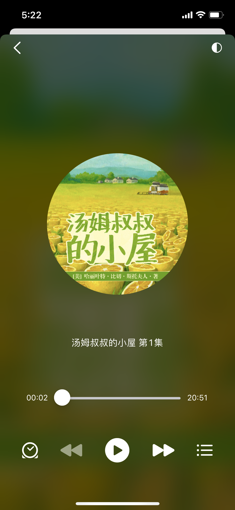
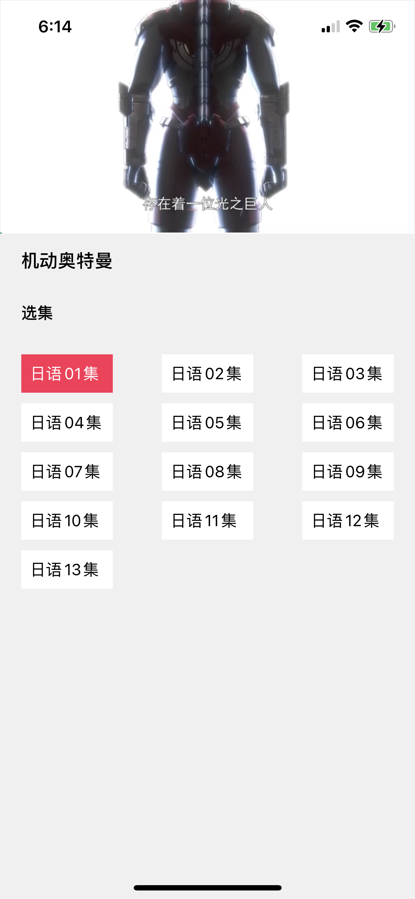

# 阅读

  
  <h1>Yuedu</h1>
   
  
阅读iOS版, 阅读是一款可以自定义来源阅读网络内容的工具，为广大网络文学爱好者提供一种方便、快捷舒适的试读体验。

> 由于阅读本身比较复杂，目前已经支持9成以上的功能了。基本布局功能和布局和安卓版类似，但是也针对系统做了些调整，方便更好的使用。

> iOS版阅读，目前处于持续开发初级阶段，目前侧重点先是可用，难免个人没注意到的细节导致解析问题/显示方面的BUG，如果遇到问题欢迎在Appstore留言，隔一段时间我会集中回复，但是不要因为这种问题恶意差评。当然也可以在此留Issue。

## 阅读3.0
* [书源规则](https://alanskycn.gitee.io/teachme/)
* [更新日志](/app/src/main/assets/updateLog.md)
* [帮助文档](/app/src/main/assets/help/appHelp.md)

## 下载

### iOS版本

Appstore测试版V1.1： [AppStore](https://apps.apple.com/cn/app/%E6%BA%90%E9%98%85%E8%AF%BB/id1561787704), 暂时由于恶意差评已下架

TF测试版： [testflight版本](https://testflight.apple.com/join/2Svrtr9y)

> 如果有条件，反馈问题前尽量先对照安卓版，避免是源的问题。 目前兼容适配，快速更新中...

### 安卓版本

 or  or [Releases](https://github.com/gedoor/legado/releases/latest)

## 免责声明
阅读只是一个解析工具，本身并不提供任何内容，没有自己的服务器，配置和显示内容完全由用户决定，和本软件无关，您可以完全把它理解成一个浏览器。

